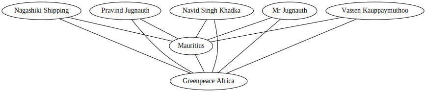

# DRAGONHACK 2020

## Team `New_folder`
- Marko Prelevikj, (backend, bitcoin, data curation)
- Gojko Hajduković, (backend, imagery processing, visualization)
- Boshko Koloski, ML: nlp, graph wizard + all in between (no sleep, kudos!)
- Ferdi Jajai, UI (mockups + UX)

## Short description 
The project addresses the problem of oil spills with the intention of spreading its awareness.
We combine multiple data sources, such as Wikipedia, Twitter, and Sinergise Satellite Imagery, to achieve this goal.
All the data sources contain distinct information from which we gain statistics.
We do all the data-crunching while preserving the data's integrity.

List of technologies used: python, bitcoincli, sentinel-hub-py, graphviz, sumy, spacy, nltk,
and a lot of patience from our designer and improvized front-end guy (thanks Gojko!). 


# Setup

The backend code is developed with Python 3. To install the dependencies needed for reproduction of results run the following line.

```bash
pip3 install -r requirments.txt
pipenv install

# set your workdir as the repo root
# run the flask server:
export FLASK_APP=be/server.py
flask run

# open the index.html file directly in your browser
```

**NOTE**: There are unused endpoints in the [server](be/server.py) file.

## Project organization

- [API, Bitcoin and Machine Learning integration](./be)
- [Visualization](./fe) <- Webpage design
- [Data](./data) <- Scraped and serialized data 


## Initial data 

The initial data of the oil spills is obtained from the Wikipedia [list of oil spills](https://en.wikipedia.org/wiki/List_of_oil_spills).
Since the table is incomplete and some key information were missing as exact coordinates.
For such examples we fill the data manually as close as possible.
Furthermore we propose a way for this to be evaluated with an algorithmic approach for early detection and awareness.


|Spill                                                        |Location                                                     |Dates                              |MinTonnes|MaxTonnes|Owner                                            |Coords                |
|-------------------------------------------------------------|-------------------------------------------------------------|-----------------------------------|---------|---------|-------------------------------------------------|----------------------|
|El Palito Refinery                                           |Venezuela, Golfo Triste                                      |8 August 2020                      |2,700    |2,700    |Petróleos de Venezuela                          |10.694448;-68.201062  |
|2020 Pointe D'Esny  MV Wakashio oil spill                    |Mauritius, Ile Aux Aigrettes and Mahebourg                   |25 July 2020                       |1,300    |4,300    |Wakashio Suisan Company Limited, Kagoshima, Japan|-20.438119;57.744631  |
|Trans Mountain oil spill                                     |Canada, British Columbia, Abbotsford                         |14 June 2020                       |118.5    |184.87   |Trans Mountain                                   |49.064499; -122.159002|
|Norilsk diesel fuel spill                                    |Russia, Norilsk, Krasnoyarsk Krai                            |29 May 2020                        |17,500   |17,500   |Nornickel                                        |69.379444;87.744444   |
|Tanker truck pumping out sludge from a vessel                |New Zealand, Tauranga, Bay of Plenty                         |30 March 2020                      |1.7      |1.7      |                                                 |-37.660155;176.231307 |


## Earth Observation Hack
We use SINERGIZE's satellite imagery for detection of the oil leaks and comparison of between time stamps.
For a given event, we scan the coordinates and obtain the imagery in the interval of `[day-30, day+30]` and obtain
a collection of unique satellite images of the given oil spill.
For such sequence of days the minimum number of images we obtained was 12 and the maximal number of images was 20. In the end, the images are compiled together in a gif, for convenience.


## Data Mining Hack
### Sentiment analysis 
Since we wanted to capture the notion of how such events affect society, we proceeded by exploring social media. Particularly we focused on the Twitter data the society tweets about for a given oil spill event. /

We scraped this data manually but also we provided an approach for it to be scraped automatically (Since Twitter recently updated their policies we went for the manual approach). 

After obtaining the data we extracted the sentiment and analyzed it through Ekman's 5 basic emotions. We executed this analysis with the ``text2emotion`` library.

In the following table you can inspect the sentiment we extracted for some of the spills:

|Spill                                                |Angry              |Fear               |Happy               |Sad                |Surprise           |
|-----------------------------------------------------|-------------------|-------------------|--------------------|-------------------|-------------------|
|Delta House floating production platform spill       |0.16666666666666666|0.16666666666666666|0.041666666666666664|0.20833333333333334|0.08333333333333333|
|Doon Iowa derail                                     |0.06666666666666667|0.3666666666666667 |0.0                 |0.12166666666666666|0.11166666666666668|
|Guarello Island iron ore export terminal diesel spill|0.06090909090909091|0.46181818181818185|0.0                 |0.28               |0.10545454545454547|
|Keystone Pipeline 2017 spill                         |0.15142857142857144|0.4192857142857143 |0.04785714285714286 |0.08               |0.15714285714285717|
|MV Chrysanthi S bunkering spill at sea               |0.08333333333333333|0.5                |0.08333333333333333 |0.16666666666666666|0.16666666666666666|
|MV Solomon Trader fuel oil spill                     |0.055              |0.2475             |0.0275              |0.22000000000000003|0.44250000000000006|
|Norilsk diesel fuel spill                            |0.0                |0.0                |0.0                 |0.9                |0.1                |
|Port Erin diesel spill (source )                     |0.034              |0.254              |0.27399999999999997 |0.04               |0.2                |
|Sanchi oil tanker collision with CF Crystal          |0.04125            |0.26875            |0.0                 |0.17375000000000002|0.39               |
|SeaRose FPSO production ship spill                   |0.0                |0.45099999999999996|0.0                 |0.11600000000000002|0.233              |
|T.G. Williams Well No. 1 tank battery                |0.07142857142857142|0.4714285714285714 |0.14714285714285716 |0.13142857142857142|0.03571428571428571|
|Trans Mountain oil s                                 |0.095              |0.3628571428571429 |0.047142857142857146|0.04142857142857143|0.3092857142857143 |
|Trans Mountain oil spill                             |0.0                |0.0                |0.0                 |0.2                |0.0                |
|True Oil pipeline                                    |0.0                |0.3325             |0.0                 |0.4175             |0.0                |


### Graph Information

Since we live in connected world, for one to analyse the interactions and one needs a good representation. Natural representation of such interactions are graphs. From them we can analyse the flows of events and interactions of entities.

With this in mind we generated a network of persons interactions based on their appearance on articles and papers. 

We used the ``googlesearch engine`` to search for links of articles and web pages containing information of oil spill events. For each oil spill event we took 30 pages and summarized them to up to 5 most representative sentences, for this we used the text-rank based extractor from the ``sumy`` library.

After obtaining between 100 and 150 sentences for each oil spill we used Named Entity Recognition (NER) tool from which we extracted the entity information. 

We modeled the graph in with the following heuristic, two entities were connected if they appeared in a single sentence. 

One such example of an obtained graph is the following about the `Pointe D'Esny MV Wakashio oil spill`:




### Meta information

From the NER information we extracted Organizations, Persons and Money values connected to the task.

## Bitcoin hack
### Integrity

Since this information is of vital character we want all of this to be secured and last forever. For this purpose, we provide we store the data in a Bitcoin ledger.


## Greater good hack

We believe that such an application would provide crucial information for spreading awareness of the consequences for the ecosystem of oil spill events. 
